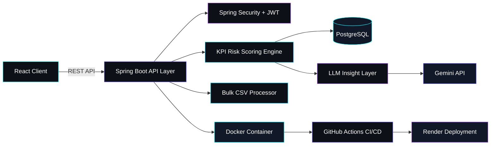

<div align="center">


<br/>


<br/><br/>

<a href="https://www.linkedin.com/in/sudhanshu-yadav-0ab42236b/"></a>
<a href="https://github.com/Sudhanshuy2006"></a>
<a href="https://sidsamvardhan.vercel.app/"></a>
<a href="mailto:sudhanshuy213@email.com"></a>

<br/><br/>


</div>


<div align="center">

## About Me

</div>

```bash
$ whoami
> Sudhanshu Yadav — Backend Engineer

$ system --status
> SYSTEM ONLINE ✅
> ROLE ............ Backend Engineer · AI Systems Integrator
> CORE STACK ....... Java · Spring Boot · PostgreSQL · Docker · AWS . Microservice
> FOCUS ............ Scalable Architecture + AI-Integrated Production Systems
> AVAILABILITY ..... Open to Contribute & Full-Time Backend Roles
> LOCATION ......... Earth

$ deployments --list
> LayoffGuard AI ............ LIVE 🟢   100% prediction accuracy
> ActiFitFlow ................ LIVE 🟢   100% secure RBAC access
> AI Email Assistant ......... LIVE 🟢   80% faster email drafting
```


<div align="center">

## Developer Operating System

</div>

<table align="center" width="100%">
<tr>
<td align="center" width="16.6%"><br/><sub><b>Java</b></sub></td>
<td align="center" width="16.6%"><br/><sub><b>Spring Boot</b></sub></td>
<td align="center" width="16.6%"><br/><sub><b>Hibernate / JPA</b></sub></td>
<td align="center" width="16.6%"><br/><sub><b>PostgreSQL</b></sub></td>
<td align="center" width="16.6%"><br/><sub><b>MySQL</b></sub></td>
<td align="center" width="16.6%"><br/><sub><b>Docker</b></sub></td>
</tr>
<tr>
<td align="center"><br/><sub><b>AWS</b></sub></td>
<td align="center"><br/><sub><b>Git</b></sub></td>
<td align="center"><br/><sub><b>GitHub Actions</b></sub></td>
<td align="center"><br/><sub><b>Maven</b></sub></td>
<td align="center"><br/><sub><b>Postman</b></sub></td>
<td align="center"><br/><sub><b>IntelliJ IDEA</b></sub></td>
</tr>
</table>

<div align="center">


</div>


<div align="center">

## Backend Engineering Dashboard

</div>

<table align="center" width="100%">
<tr>
<td align="center" width="25%">⚡<br/><b>40%</b><br/><sub>API Performance Gain</sub></td>
<td align="center" width="25%">🎯<br/><b>80%</b><br/><sub>KPI Risk-Prediction Accuracy</sub></td>
<td align="center" width="25%">🤖<br/><b>70%</b><br/><sub>Manual Effort Reduced via LLM</sub></td>
<td align="center" width="25%">📦<br/><b>100+</b><br/><sub>Records Processed / Request</sub></td>
</tr>
<tr>
<td align="center">🔐<br/><b>100%</b><br/><sub>Secure RBAC Access Control</sub></td>
<td align="center">🚀<br/><b>80%</b><br/><sub>Email Drafting Time Cut</sub></td>
<td align="center">🔁<br/><b>50%</b><br/><sub>Faster Follow-Up Turnaround</sub></td>
<td align="center">🐳<br/><b>3</b><br/><sub>Dockerized Production Systems</sub></td>
</tr>
</table>


<div align="center">

## 🎯 Skill Matrix

</div>

| Domain | Proficiency |
|:--|:--|
| **Java** | `█████████░` |
| **Spring Boot / Spring Security** | `█████████░` |
| **JPA / Hibernate** | `████████░░` |
| **PostgreSQL / MySQL** | `████████░░` |
| **REST API Design** | `█████████░` |
| **Docker / Containerization** | `████████░░` |
| **CI/CD (GitHub Actions)** | `███████░░░` |
| **AWS** | `██████░░░░` |
| **Microservice** | `█████░░░░░` |
| **Linux** | `█████████░` |


<div align="center">

## Architecture Visualization — LayoffGuard AI

</div>




<div align="center">

## ☁️ Cloud & DevOps Command Panel


</div>


<div align="center">

## 🧭 Current Mission

</div>

<table align="center" width="90%"><tr><td>

Engineering production-grade backend systems that fuse traditional Spring Boot architecture with AI-driven intelligence — focused on scalability, secure-by-design APIs, and measurable business impact. Currently expanding expertise in microservices, AWS, distributed systems, load balancing, and cloud-native architecture to build resilient, scalable, and high-performance applications.

</td></tr></table>


<div align="center">

## 🌐 Recruiter Quick Summary

</div>

| | |
|:--|:--|
| 🎯 **Role** | Backend Developer |
| 🛠️ **Tech Skills** | Java · Spring Boot/Spring Security · PostgreSQL/JDBC · Hibernate/JPA · Docker/CI&CD · AWS . Microservice  · REST APIs · AI-Integrated Production Systems . Linux .  system architectures |
| 📍 **Location** | India |
| 💼 **Availability** | Open to Internship & Backend Developer Roles |
| 📧 **Contact** | sudhanshuy213@email.com |
| 🔗 **Portfolio** | [sidsamvardhan.vercel.app](https://sidsamvardhan.vercel.app/) |


<div align="center">

##  Project Showcase

</div>

<table width="100%">
<tr>
<td width="50%" valign="top">

### 🛡️ LayoffGuard AI


**AI-powered layoff risk intelligence platform**

Predicts employee layoff risk from real-world KPIs, generating automated risk scores, skill-gap analysis, and personalized upskilling recommendations.

- 🎯 9+ metric KPI risk-scoring engine — **80% prediction accuracy**
- 🤖 LLM-integrated insights — cut manual effort by **70%**
- ⚡ Backend & API response time optimized by **40%**
- 📦 Bulk CSV ingestion — 100+ records per request
- 🐳 Dockerized · CI/CD via GitHub Actions · Render deployment
- 🧩 Modular, microservices-ready layered architecture

   

[🔗 View Repository](https://github.com/Sudhanshuy2006/layoff-risk-system)

</td>
<td width="50%" valign="top">

### 💪 ActiFitFlow


**Secure backend for fitness workflow & activity tracking**

Stateless, RBAC-secured backend engine with a built-in activity-based recommendation system.

- 🔐 JWT + RBAC auth flow — **100% secure access control**
- ⚡ Critical bug resolution — **+35% API response time**
- 🧩 Clean layered architecture with validated REST endpoints
- 🎯 Recommendation engine driven by activity data
- 🐳 Containerized for consistent, repeatable deployment

   

[🔗 View Repository](https://github.com/Sudhanshuy2006/ActiFlowBackendWithSecuity.Docker)

</td>
</tr>
<tr>
<td width="50%" valign="top">

### ✉️ AI-Powered Email Assistant


**AI copilot for Gmail — smart replies, summaries, real-time suggestions**

Chrome extension paired with a Spring Boot backend that brings LLM-powered drafting directly into the inbox.

- ⚡ Email drafting time cut by **~80%**
- 🎯 Response accuracy improved by **45%**
- 🔁 Automated follow-ups & categorization — **50% faster turnaround**
- 🧩 Real-time Gmail integration via React Chrome Extension

   

[🔗 View Repository](https://github.com/Sudhanshuy2006/MailGenie-Chrome-Extension)

</td>
<td width="50%" valign="top">

</td>
</tr>
</table>


<div align="center">

## 🧬 Open Source Contribution Zone


Always open to collaborating on backend, AI-integration, and developer-tooling projects. Feel free to fork, raise issues, or open a PR on any repository above.

</div>


<div align="center">

## 📊 GitHub Analytics


<br/>


</div>

<!--
SNAKE SETUP NOTE (does not render on GitHub, for repo owner only):
To activate the contribution snake below, add a GitHub Actions workflow using
Platane/snk in this profile repo (Sudhanshuy2006/Sudhanshuy2006) that generates
and pushes the SVG to an "output" branch. Once active, the embed below will render.
-->

<div align="center">

## 🎖️ Hackathons & Recognition

**GENGNITE 2025 — HackWithIndia** *(National-Level Hackathon)*
Built an AI-powered solution under time constraints — demonstrating rapid prototyping, problem-solving, and teamwork · **Certified Participation**

</div>


<div align="center">

## 💼 Open to Opportunitie


**Focused on scalable backend engineering, cloud-native applications, and Microservice production-grade AI-integrated software.**

</div>


<div align="center">

## 📬 Connect

<a href="https://www.linkedin.com/in/sudhanshu-yadav-0ab42236b/"></a>
<a href="https://github.com/Sudhanshuy2006"></a>
<a href="mailto:sudhanshuy213@email.com"></a>
<a href="https://sidsamvardhan.vercel.app/"></a>

<br/><br/>


</div>
