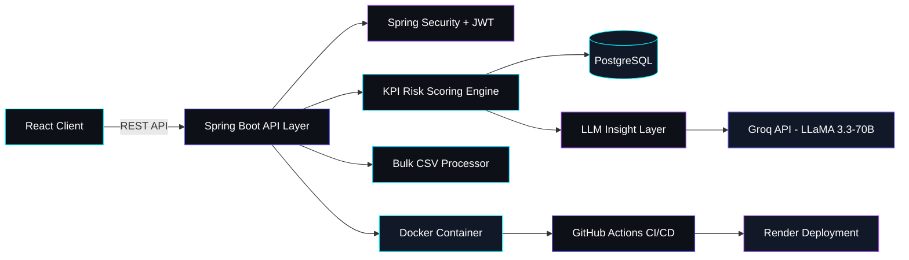

 

## About Me

I'm a final-year BCA student and self-taught Java backend developer. Started with zero industry experience — over the last few months I've independently designed, built, and deployed three full-stack backend systems, each integrating a real LLM API into the core workflow rather than bolting AI on as an afterthought.

- 🎯 **Focus:** Spring Boot backend systems with clean layered architecture (Controller-Service-Repository)
- 🤖 **AI-native workflow:** Using Groq (LLaMA 3.3-70B) and Gemini for production features, plus Claude/GitHub Copilot as daily coding assistants
- 📚 **Currently:** Solving DSA on LeetCode, deepening advanced AWS and microservices fundamentals
- 📊 **170+ GitHub contributions** and counting

## Tech Stack

<table align="center" width="100%">
<tr>
<td align="center" width="16.6%"> <b>Java</b></td>
<td align="center" width="16.6%"> <b>Spring Boot</b></td>
<td align="center" width="16.6%"> <b>Hibernate / JPA</b></td>
<td align="center" width="16.6%"> <b>PostgreSQL</b></td>
<td align="center" width="16.6%"> <b>MySQL</b></td>
<td align="center" width="16.6%"> <b>Docker</b></td>
</tr>
<tr>
<td align="center"> <b>React</b></td>
<td align="center"> <b>Git</b></td>
<td align="center"> <b>GitHub Actions</b></td>
<td align="center"> <b>Maven</b></td>
<td align="center"> <b>Postman</b></td>
<td align="center"> <b>AWS (fundamentals)</b></td>
</tr>
</table>

## Project Showcase

### 🛡️ LayoffGuard AI

**AI-powered layoff risk intelligence platform** — full-stack app (React frontend + Spring Boot backend) that scores employee layoff risk from 9 real-world KPIs and generates an AI-driven upskilling roadmap.

- 🎯 9-signal KPI risk-scoring engine — **80% prediction accuracy**
- 🤖 Groq API (LLaMA 3.3-70B) integration for AI-generated insights — cut manual analysis effort by **~70%**
- ⚡ Optimized bulk-operation API response time by **~40%**
- 📦 Bulk CSV import handling **100+ records** per request
- 🔐 JWT auth + role-based access (Employee/HR/Admin) via Spring Security
- 🧪 SonarQube integrated into the CI pipeline for static code analysis
- 🐳 Dockerized · CI/CD via GitHub Actions · deployed on Render

   

[🔗 View Repository](https://github.com/Sudhanshuy2006/layoff-risk-system)

---

### 💪 ActiFitFlow

**Secure backend for fitness workflow & activity tracking** — stateless, JWT-secured backend with a built-in activity-based recommendation engine.

- 🔐 Stateless JWT auth (filter + SecurityContext) with BCrypt password hashing
- ⚡ Debugged token-validation and bulk-data edge cases — improved API response time by **~40%**
- 🐳 Reduced Docker image size by **~60%** via multi-stage builds
- 🧩 2 relational entities (User, Activity) across a 3-layer architecture (Controller-Service-Repository)
- 🗄️ MySQL locally, PostgreSQL in production
- 🧪 SonarQube for static code analysis

   

[🔗 View Repository](https://github.com/Sudhanshuy2006/ActiFlowBackendWithSecuity.Docker)

---

### ✉️ MailGenie — AI Email Assistant

**AI copilot for Gmail** — Chrome extension (Manifest v3) that injects an AI action button into Gmail's compose window and generates professional replies via a secure backend using the Gemini API.

- ⚡ Cuts email drafting time by **~80%**
- 🔁 Automated follow-ups and template categorization for faster turnaround
- 🧩 Real-time Gmail integration via DOM injection, no page reload needed
- 🔐 Minimal, Chrome Store–compliant permission scope

  

[🔗 View Repository](https://github.com/Sudhanshuy2006/MailGenie-Chrome-Extension)

## Architecture — LayoffGuard AI

## Currently Learning

- 🧩 **DSA** — solving arrays, strings, linked lists, sorting/searching problems on LeetCode
- ☁️ **Advanced AWS** — EC2, S3, RDS, and cloud-native deployment patterns
- 🧱 **Advanced Microservices** — service decomposition, inter-service communication, and distributed backend systems
- ⚖️ Load balancing and horizontally scalable architecture — moving beyond single-service layered design

## GitHub Analytics

  

If the cards above don't render, GitHub's stats API is temporarily rate-limited — refresh the page.

## Hackathons & Recognition

**GENGNITE 2025 — HackWithIndia** *(National-Level Hackathon)*
Built an AI-powered solution under time constraints — Certificate of Participation.

## Let's Connect

